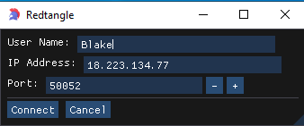
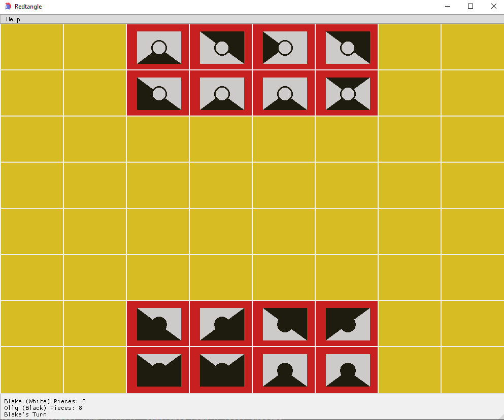
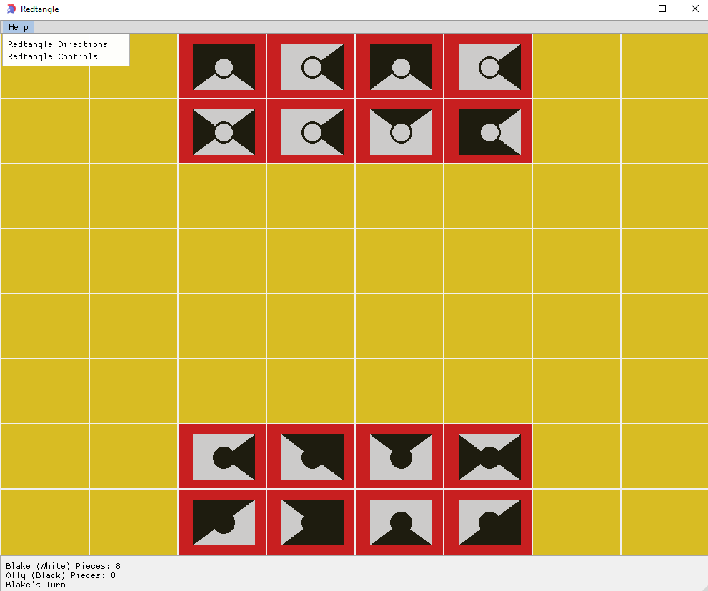
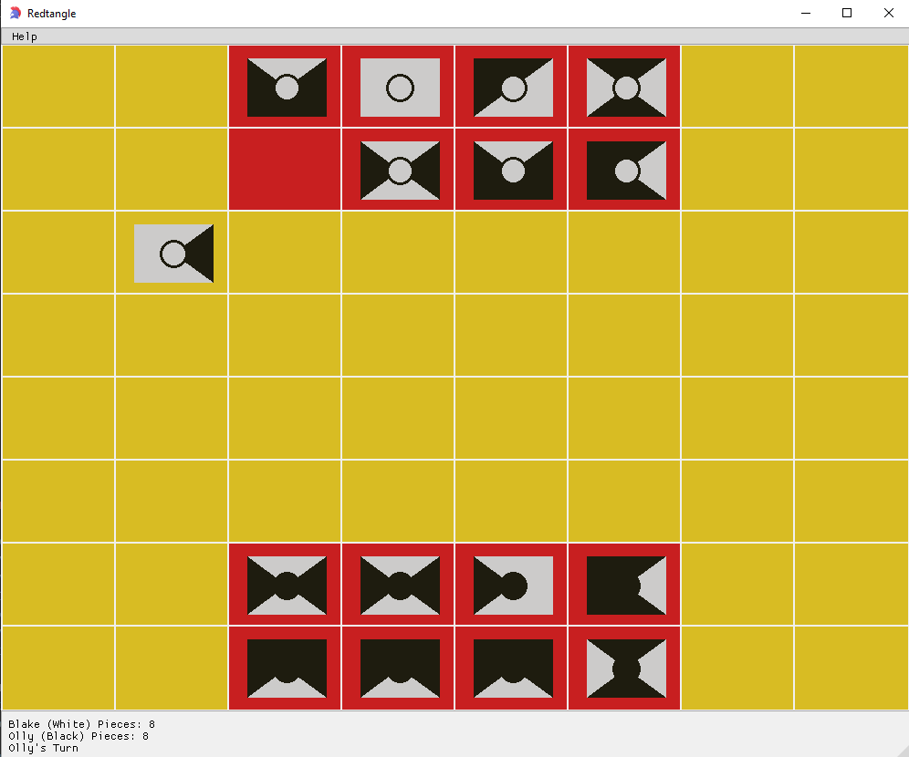
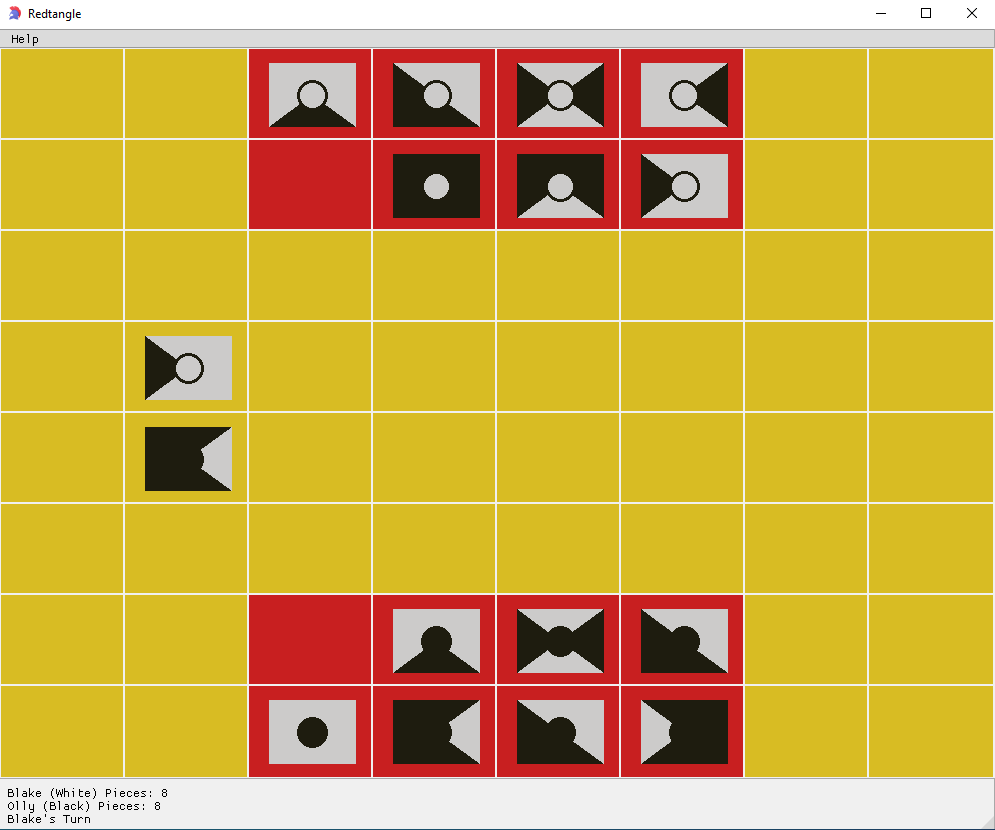
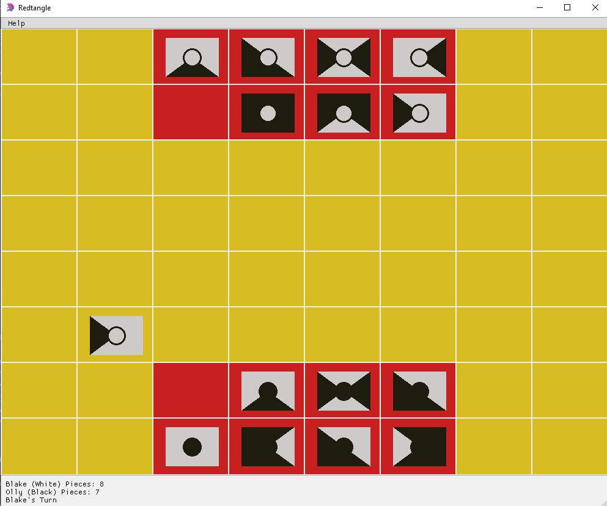
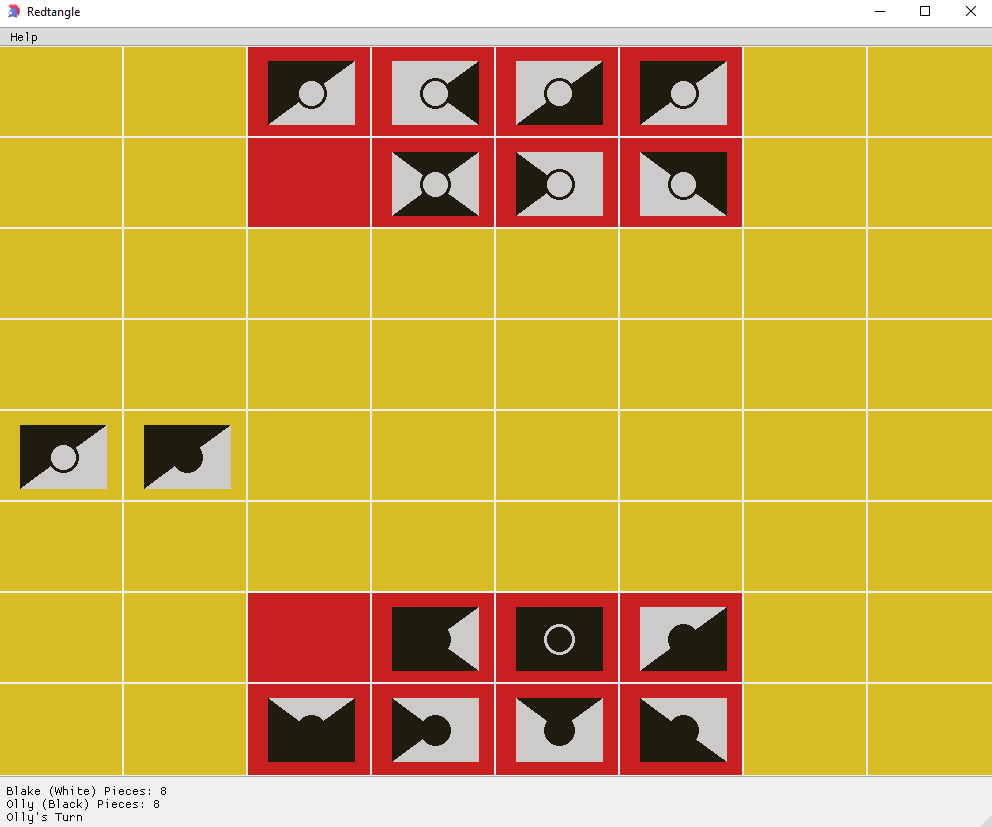
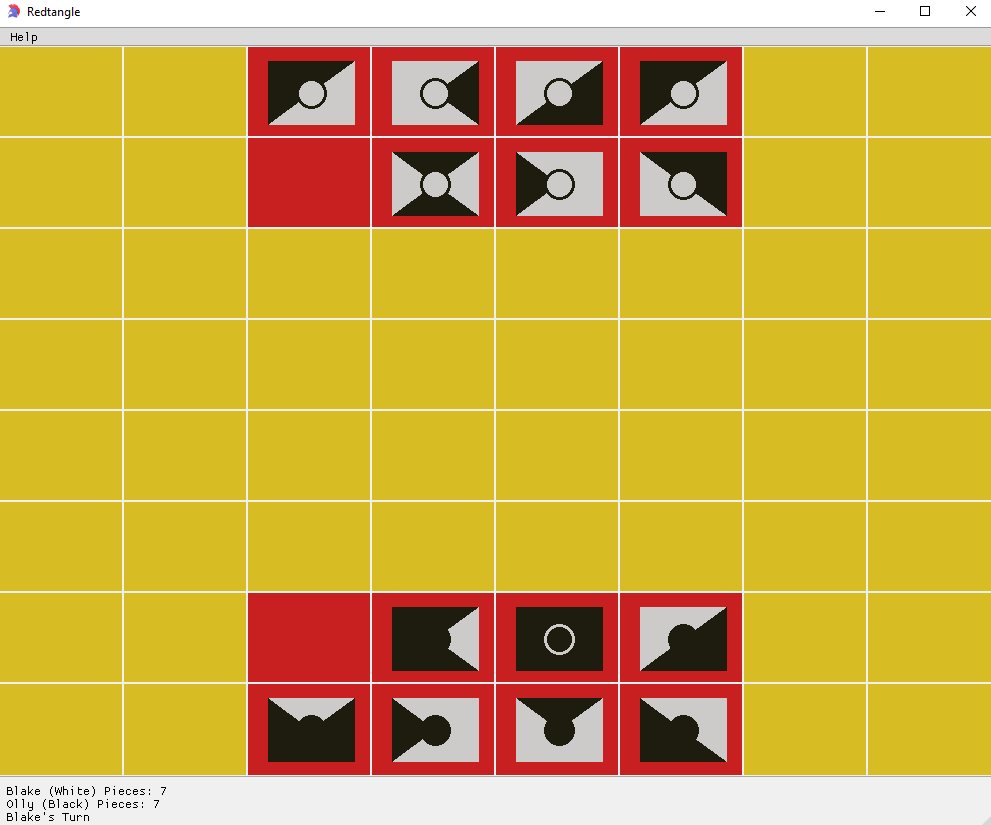
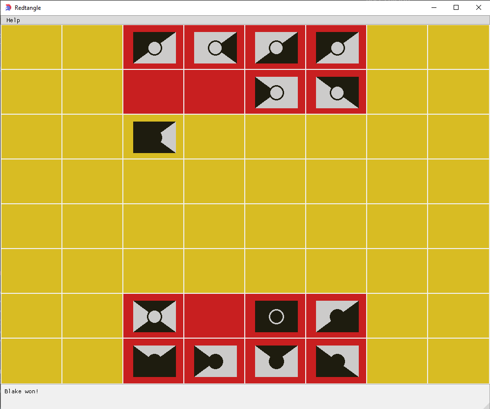

# Redtangle Tutorial 

## Connecting to the gRPC Server

When the application launches, a popup will be displayed to enter username, ip address and port of the gRPC Server. Click 'Connect' to connect to the gRPC Server 

## Main UI 
After connecting to the gRPC Server, the game ui will be displayed:

For directions on game rules or controls, click `Help->Game Directions` or `Help->Game Controls`

   

**Direct links**:
- [Directions](./docs/directions.pdf)
- [Controls](./docs/controls.md)

## Moving to Eight Adjacent Square
To move a piece to an eight adjacent square, simply click the piece then click the eight adjacent square:

## Jumping a Piece 
To jump a piece, select the empty space to jump pieces. If the sides connecting two pieces on different teams are different, then the piece(s) can be jumped. 

**Pre-Jump**

**Post-Jump**

## Suicide Move

A suicide move can be taken which results in both pieces being lost. This occurs when a piece jumps a piece and lands off the board. To perform this move, simply select the piece to jump and both pieces will be lost.

**Pre-Suicide**

**Post-Suicide**

## Winning Move
To win, perform a move into the opponents redtangle. Diagnol moves are not permitted. 

